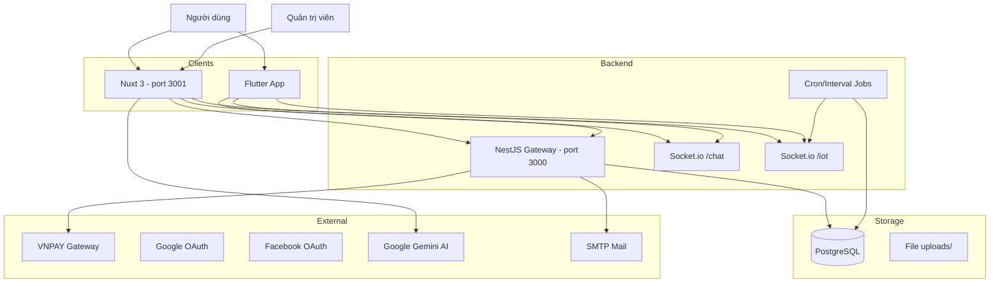
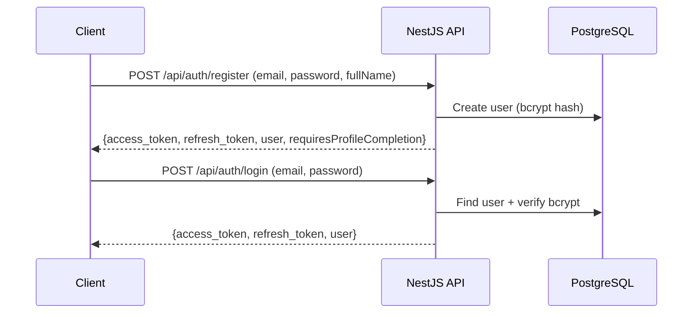
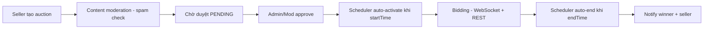
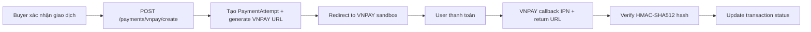

# PROJECT_CONTEXT.md

> Tài liệu kiến trúc tổng quan cho EV Resale Platform.
> Cập nhật: 2026-05-12

---

## 1. Tổng quan hệ thống

Nền tảng mua bán pin xe điện cũ (EV Battery Resale Platform) — monorepo gồm 3 phần:

| Thành phần  | Công nghệ                     | Port mặc định |
| ----------- | ----------------------------- | ------------- |
| **be/**     | NestJS + Prisma + PostgreSQL  | `:3000`       |
| **FE/**     | Nuxt 3 + Vue 3 + Nuxt UI      | `:3001`       |
| **mobile/** | Flutter + Riverpod + GoRouter | N/A           |

**Database:** PostgreSQL 15 (Docker container `evn_postgres`, DB name `evn_market`)

**Real-time:** Socket.io (2 namespaces: `/chat`, `/iot`)

**Payment:** VNPAY sandbox integration

**AI:** Google Gemini API (FE server route for AI chat/pricing)



---

## 2. Trách nhiệm từng phần

### 2.1 Backend (`be/`)

Vai trò: **API Gateway + Business Logic + Real-time**

- REST API (global prefix `/api`)
- Swagger docs tại `http://localhost:3000/api`
- JWT auth (access + refresh token)
- OAuth (Google, Facebook) via Passport strategies
- WebSocket gateways: Chat (`/chat`) + IoT (`/iot`)
- PLC Simulator: giả lập dữ liệu pin IoT mỗi 5 giây
- Content moderation: spam detection dựa trên keywords + giá thị trường
- Contract management: tạo PDF, ký số, gửi email
- Payment: VNPAY (create URL → callback IPN/return → update transaction status)
- Scheduled tasks: auction auto-start/end (`@nestjs/schedule`)
- File uploads: static serve từ `uploads/` directory
- Admin bootstrap: tự tạo admin account khi khởi động
- Mail + SMS services

### 2.2 Frontend (`FE/`)

Vai trò: **Web Dashboard cho seller, buyer và admin**

- SSR-capable Nuxt 3 app
- Proxy backend qua `/be` path (tránh xung đột với Nuxt `/api` routes)
- i18n: 3 ngôn ngữ (vi, en, ja), mặc định `vi`
- Dark/light mode (`@nuxtjs/color-mode`)
- Auth state lưu trong cookies (`auth-token`, `auth-user`)
- Route middleware bảo vệ `/dashboard`, `/admin`, `/sell`
- Admin panel: analytics, quản lý users, posts, auctions, contracts, fees, support tickets
- Moderator: quyền hạn riêng theo `moderatorPermissions` array
- Composables pattern: `useAuth`, `useApi`, `useAuctions`, `useChatRooms`, `useNotifications`, etc.
- AI features: `useAIChat` + `useAIPricing` (gọi Gemini qua Nuxt server route)

### 2.3 Mobile (`mobile/`)

Vai trò: **Mobile app cho buyer + on-the-go tracking**

- Flutter 3.10+ with Riverpod state management
- GoRouter navigation with auth guard
- Dio HTTP client with auto token refresh interceptor
- Feature-based architecture: `features/<feature>/screens/` + `features/<feature>/providers/`
- Shared: `services/`, `models/`, `widgets/`, `core/`
- Socket.io client cho chat + IoT battery monitoring
- Google Sign-In
- L10n: vi + en
- Secure storage cho JWT tokens

---

## 3. Cấu trúc thư mục

```
ev-resale-platform/
├── be/                          # NestJS Backend
│   ├── prisma/
│   │   ├── schema.prisma        # 918 dòng - toàn bộ DB schema
│   │   ├── seed.ts              # Seed data
│   │   └── migrations/          # Prisma migrations
│   ├── src/
│   │   ├── main.ts              # Bootstrap, CORS, Swagger, static assets
│   │   ├── app.module.ts        # Root module - imports tất cả modules
│   │   ├── prisma/              # PrismaService (global)
│   │   ├── auth/                # JWT, Google, Facebook strategies + guards
│   │   ├── users/               # CRUD user, KYC, reviews
│   │   ├── vehicles/            # Vehicle listings CRUD
│   │   ├── batteries/           # Battery listings CRUD
│   │   ├── accessories/         # Accessory listings CRUD
│   │   ├── auctions/            # Auction CRUD + scheduler + bid logic
│   │   ├── bids/                # Bid management
│   │   ├── chat/                # ChatGateway (WS) + ChatService + REST
│   │   ├── iot/                 # IoT Gateway (WS) + PLC Simulator
│   │   ├── transactions/        # Transaction lifecycle
│   │   ├── contracts/           # PDF generation + e-signatures
│   │   ├── payments/            # VNPAY integration
│   │   ├── payment-methods/     # Saved payment cards
│   │   ├── purchases/           # Buyer purchase tracking
│   │   ├── notifications/       # In-app notifications
│   │   ├── admin/               # Admin analytics + admin guard
│   │   ├── fees/                # Fee/commission management
│   │   ├── moderation/          # Content spam detection
│   │   ├── comparisons/         # Product comparison
│   │   ├── dashboard/           # Dashboard stats + favorites
│   │   ├── uploads/             # File upload endpoints
│   │   ├── mail/                # SMTP email service
│   │   ├── sms/                 # SMS service
│   │   ├── stats/               # Statistics endpoints
│   │   ├── settings/            # App settings KV store
│   │   ├── support-tickets/     # Support ticket system
│   │   ├── audit-logs/          # Audit logging
│   │   └── common/              # Shared constants + admin bootstrap
│   └── test/                    # E2E tests
│
├── FE/                          # Nuxt 3 Frontend
│   ├── nuxt.config.ts           # Config: proxy, i18n, color-mode
│   ├── composables/             # Vue composables (useAuth, useApi, etc.)
│   ├── pages/                   # File-based routing
│   │   ├── index.vue            # Home
│   │   ├── login.vue, register.vue
│   │   ├── vehicles/, batteries/, accessories/
│   │   ├── auctions/            # List, detail, create, my auctions
│   │   ├── chat/                # Chat list + room
│   │   ├── contracts/           # Contract signing UI
│   │   ├── transactions/        # Transaction creation
│   │   ├── payments/vnpay/      # VNPAY return page
│   │   ├── dashboard/           # User dashboard
│   │   ├── admin/               # Admin panel (analytics, users, posts, fees...)
│   │   └── auth/                # OAuth callback + complete-profile
│   ├── layouts/                 # default, dashboard, admin, empty
│   ├── middleware/auth.js       # Route protection + role-based access
│   ├── plugins/                 # API client, auth-init
│   ├── i18n/, locales/          # Internationalization
│   ├── server/api/chat/         # Nuxt server route for Gemini AI
│   ├── types/                   # TypeScript types
│   └── tests/e2e/               # Playwright tests
│
├── mobile/                      # Flutter Mobile App
│   ├── lib/
│   │   ├── main.dart            # App entry point
│   │   ├── core/
│   │   │   ├── auth/            # Session state provider
│   │   │   ├── constants/       # AppConstants (baseUrl, labels)
│   │   │   ├── network/         # Dio client + auth interceptor
│   │   │   ├── router/          # GoRouter config + auth redirect
│   │   │   ├── theme/           # App theme
│   │   │   └── utils/           # Utilities
│   │   ├── features/
│   │   │   ├── auth/            # Login, register, forgot-password, splash, welcome
│   │   │   ├── home/            # Home screen
│   │   │   ├── batteries/       # List, detail, sell, monitor (IoT)
│   │   │   ├── vehicles/        # List, detail, sell
│   │   │   ├── accessories/     # List, detail, sell
│   │   │   ├── auctions/        # List, detail, create + providers
│   │   │   ├── chat/            # Chat list, room, signature pad, contract card
│   │   │   ├── notifications/   # Notifications screen
│   │   │   ├── profile/         # Profile, KYC verification
│   │   │   └── admin/           # KYC management
│   │   ├── models/              # Data models (JSON serializable)
│   │   ├── services/            # API service layer (Dio-based)
│   │   └── widgets/             # Shared widgets
│   ├── .env.example             # API_URL, GOOGLE_CLIENT_ID
│   └── pubspec.yaml             # Dependencies
│
├── scripts/                     # Automation scripts
│   ├── e2e-sell.mjs
│   └── run-e2e-sell.sh
│
├── docker-compose.yml           # PostgreSQL + pgAdmin + BE + FE
├── CLAUDE.md                    # AI coding guidelines
└── package.json                 # Root: @google/generative-ai, vnpay
```

---

## 4. Luồng xác thực (Authentication Flow)

### 4.1 Local Auth



### 4.2 Google OAuth

- **Web (FE):** Google One Tap → `POST /api/auth/google/verify` (credential) → verify ID token → upsert user → JWT
- **Web (FE):** Passport flow → `GET /auth/google` → callback → redirect to FE with token in URL
- **Mobile:** `google_sign_in` package → get ID token → `POST /api/auth/google/verify`

### 4.3 Token Refresh

- **Backend:** `POST /api/auth/refresh` with `{refresh_token}` → verify → issue new pair
- **FE:** Token stored in cookie `auth-token` (7 day maxAge), no auto-refresh
- **Mobile:** Dio `AuthInterceptor` auto-refresh on 401 → retry failed request → on failure: clear storage + trigger `sessionExpiredTickProvider`

### 4.4 Password Reset

`POST /api/auth/password/forgot` → OTP via email → `POST /api/auth/password/verify` → `POST /api/auth/password/reset`

### 4.5 Guards & Roles

- `JwtAuthGuard`: JWT verification
- `RolesGuard`: `@Roles(UserRole.ADMIN)` decorator
- `PermissionsGuard`: `@Permissions('MODERATE_POSTS')` decorator
- Roles: `USER`, `ADMIN`, `MODERATOR`
- Moderator permissions: `MODERATE_POSTS`, `HANDLE_SUPPORT_TICKETS`

---

## 5. API / Data Flow

### 5.1 FE → Backend

```
FE (browser) → /be/... → Nuxt devProxy rewrites to http://localhost:3000/api/...
```

- `useApi()` composable: fetch-based, reads `auth-token` cookie, sends `Authorization: Bearer`
- Runtime config: `NUXT_PUBLIC_API_BASE_URL` (default `/be`)
- Vite proxy: `/be` → `http://localhost:3000/api` (rewrite prefix)
- Upload proxy: `/uploads` → `http://localhost:3000/uploads`

### 5.2 Mobile → Backend

```
Mobile (Dio) → AppConstants.baseUrl → http://<host>:3000/api/...
```

- Android emulator: `http://10.0.2.2:3000/api`
- iOS/Web: `http://localhost:3000/api`
- Configurable via `.env` → `API_BASE_URL`
- `AuthInterceptor`: attach JWT, auto-refresh on 401

### 5.3 WebSocket Connections

- Chat: `ws://localhost:3000/chat` — JWT in handshake auth or Authorization header
- IoT: `ws://localhost:3000/iot` — same JWT auth pattern

---

## 6. Kiến trúc Auction / Chat / Payment

### 6.1 Auction



- Module: `be/src/auctions/` — service 1000+ dòng
- `AuctionsScheduler`: `@Cron` jobs cho auto-start/end
- Spam detection: `ContentModerationService` kiểm tra keywords + giá
- Bid validation: `bidStep`, `buyNowPrice`, amount > currentPrice
- Notifications: email + SMS + in-app cho seller/bidder/admin

### 6.2 Chat

- `ChatGateway` (Socket.io namespace `/chat`): `joinRoom`, `sendMessage`, `markAsRead`
- `ChatService`: CRUD rooms + messages, propose contract from chat
- `ChatRoom`: buyer ↔ seller, linked to vehicle/battery
- Messages support metadata (contract proposals, etc.)
- REST endpoints for room listing + history

### 6.3 Payment (VNPAY)



- Payment types: `DEPOSIT` (50%), `BALANCE` (remaining 50%), `FULL`
- Transaction status flow: `PENDING → AWAITING_DEPOSIT → DEPOSIT_PAID → AWAITING_CONTRACT → CONTRACT_SIGNED → AWAITING_BALANCE → COMPLETED`
- Config: `VNPAY_TMN_CODE`, `VNPAY_HASH_SECRET`, `VNPAY_RETURN_URL`, `VNPAY_PAYMENT_URL`

### 6.4 Contract

- Auto-created when transaction reaches deposit-paid
- PDF generation via `pdf-lib`
- E-signature: base64 image → stored in `uploads/contracts/signatures/`
- Both buyer + seller must sign → status COMPLETED
- Email notifications for signature requests + final contract

### 6.5 IoT / Battery Monitor

- `PlcSimulatorService`: `@Interval(5000)` — simulates voltage/current/temp/SOC/SOH
- Updates DB + broadcasts via `IotGateway` (`battery:telemetry` event)
- Client subscribes to `subscribeBattery(batteryId)` → joins room `battery:<id>`
- Mobile: `BatteryMonitorScreen` with real-time charts

---

## 7. Khởi động & Lệnh quan trọng

### Backend

```bash
cd be
yarn install
# Copy .env.example → .env (cần tạo nếu chưa có)
npx prisma migrate dev     # Chạy migrations
npx prisma db seed         # Seed data
yarn start:dev             # Dev mode (port 3000)
```

### Frontend

```bash
cd FE
yarn install
yarn dev                   # Dev mode (port 3001)
```

### Mobile

```bash
cd mobile
flutter pub get
# Copy .env.example → .env
flutter run                # Android/iOS
```

### Docker (full stack)

```bash
docker-compose up -d       # PostgreSQL + pgAdmin + BE + FE
# pgAdmin: http://localhost:8080 (admin@evnmarket.com / admin123)
```

### Prisma

```bash
cd be
npx prisma studio          # DB GUI
npx prisma generate         # Regenerate client
npx prisma migrate dev      # Create + apply migration
npx prisma db push          # Push schema (no migration)
```

---

## 8. Config & Environment Files

### Backend (`be/.env`)

| Biến                     | Mô tả                                           |
| ------------------------ | ----------------------------------------------- |
| `DATABASE_URL`           | PostgreSQL connection string                    |
| `JWT_SECRET`             | Secret cho access token                         |
| `JWT_EXPIRES_IN`         | Access token TTL (default: `7d`)                |
| `JWT_REFRESH_SECRET`     | Secret cho refresh token                        |
| `JWT_REFRESH_EXPIRES_IN` | Refresh token TTL (default: `30d`)              |
| `GOOGLE_CLIENT_ID`       | Google OAuth client ID                          |
| `GOOGLE_CLIENT_SECRET`   | Google OAuth secret                             |
| `FACEBOOK_APP_ID`        | Facebook OAuth app ID                           |
| `FACEBOOK_APP_SECRET`    | Facebook OAuth secret                           |
| `CORS_ORIGIN`            | Frontend URL (default: `http://localhost:3001`) |
| `FRONTEND_URL`           | Frontend URL for CORS                           |
| `VNPAY_TMN_CODE`         | VNPAY merchant code                             |
| `VNPAY_HASH_SECRET`      | VNPAY HMAC secret                               |
| `VNPAY_PAYMENT_URL`      | VNPAY payment URL                               |
| `VNPAY_RETURN_URL`       | Callback URL after payment                      |
| `MAIL_*`                 | SMTP config                                     |
| `PORT`                   | Server port (default: `3000`)                   |

### Frontend (`FE/.env` / runtime)

| Biến                           | Mô tả                                    |
| ------------------------------ | ---------------------------------------- |
| `NUXT_PUBLIC_API_BASE_URL`     | API base URL (default: `/be`)            |
| `NUXT_PUBLIC_GOOGLE_CLIENT_ID` | Google OAuth client ID                   |
| `GEMINI_API_KEY`               | Google Gemini API key (server-side only) |

### Mobile (`mobile/.env`)

| Biến                   | Mô tả                        |
| ---------------------- | ---------------------------- |
| `API_BASE_URL`         | Backend API URL              |
| `GOOGLE_WEB_CLIENT_ID` | Google Sign-In client ID     |
| `GOOGLE_IOS_CLIENT_ID` | Google Sign-In iOS client ID |

### Docker Compose

- PostgreSQL: `postgres:postgres123@localhost:5432/evn_market`
- pgAdmin: `admin@evnmarket.com / admin123` on port `8080`
- JWT Secret hardcoded in compose: `evn-market-super-secret-key-2025`

---

## 9. Vùng rủi ro & cần chú ý

### 🔴 Bảo mật

1. **JWT secret hardcoded** trong `docker-compose.yml` (`evn-market-super-secret-key-2025`) — phải thay đổi cho production
2. **Google Client ID hardcoded** trong `mobile/lib/core/constants/app_constants.dart` — nên chuyển hoàn toàn sang `.env`
3. **FE auth token trong cookie không httpOnly** — token có thể bị XSS đọc
4. **CORS `origin: '*'`** trên cả 2 WebSocket gateways (chat + IoT) — nên restrict
5. **Fallback JWT secret** trong `auth.service.ts`: `'evn-market-dev-jwt-refresh-secret'` — chỉ nên dùng khi dev
6. **Payment card encryption** (`PaymentMethod` model) — cần audit cách quản lý key/IV

### 🟡 Kiến trúc

7. **`auctions.service.ts` 1000+ dòng, `contracts.service.ts` 1129 dòng** — quá lớn, nên tách
8. **FE `useAuth` không auto-refresh token** — có thể bị expired khi user dùng lâu (mobile có, FE không)
9. **FE middleware `auth.js` dùng JavaScript** thay vì TypeScript — inconsistent
10. **`any` type** xuất hiện nhiều trong backend services (query builders, DTOs)
11. **Prisma schema 918 dòng một file** — chưa đến mức tách, nhưng đang lớn dần

### 🟠 Vận hành

12. **Không có `.env.example` cho `be/`** — developer mới khó setup
13. **Root `package.json`** chỉ có 2 dependencies (`@google/generative-ai`, `vnpay`) — mục đích không rõ, có thể là residual
14. **PLC Simulator luôn chạy** (`@Interval(5000)`) — update tất cả AVAILABLE batteries mỗi 5s, có thể gây tải DB nếu data lớn
15. **Không có rate limiting** trên API endpoints
16. **Không có health check endpoint rõ ràng** (AppController có thể có nhưng chưa verify)

### 🟢 Tốt

- Feature-based folder structure rõ ràng (mobile)
- Module-based architecture (backend NestJS)
- Auto-refresh token pattern (mobile Dio interceptor)
- Content moderation cho listings
- Audit log system
- Contract e-signature workflow hoàn chỉnh

---

## 10. Database Models (Prisma Schema Summary)

| Model                | Mô tả                                                                       |
| -------------------- | --------------------------------------------------------------------------- |
| `User`               | Người dùng (USER/ADMIN/MODERATOR), OAuth links                              |
| `Profile`            | Thông tin chi tiết + KYC (CCCD/CMND)                                        |
| `Vehicle`            | Xe điện rao bán                                                             |
| `Battery`            | Pin xe điện + IoT fields (voltage, current, temp, SOC, SOH)                 |
| `Accessory`          | Phụ kiện xe                                                                 |
| `Auction`            | Phiên đấu giá (VEHICLE/BATTERY/OTHER)                                       |
| `AuctionMedia`       | Hình ảnh đấu giá                                                            |
| `Bid`                | Lượt đặt giá                                                                |
| `Transaction`        | Giao dịch mua bán (lifecycle phức tạp 9 trạng thái)                         |
| `Contract`           | Hợp đồng điện tử                                                            |
| `ContractSignature`  | Chữ ký số                                                                   |
| `PaymentAttempt`     | Lượt thanh toán VNPAY                                                       |
| `PaymentMethod`      | Thẻ đã lưu (encrypted)                                                      |
| `Purchase`           | Tracking đơn hàng buyer                                                     |
| `TransactionDispute` | Tranh chấp giao dịch                                                        |
| `ChatRoom`           | Phòng chat buyer ↔ seller                                                   |
| `ChatMessage`        | Tin nhắn                                                                    |
| `Notification`       | Thông báo in-app                                                            |
| `Favorite`           | Yêu thích (vehicle/battery/auction)                                         |
| `Review`             | Đánh giá                                                                    |
| `Comparison`         | So sánh sản phẩm                                                            |
| `Settings`           | KV config                                                                   |
| `AuditLog`           | Audit trail                                                                 |
| `PasswordReset`      | OTP reset password                                                          |
| Fee models           | `TransactionFeeSetting`, `ListingFeeTier`, `CommissionTier`, `FeeChangeLog` |
| `SupportTicket`      | Phiếu hỗ trợ                                                                |

---

## 11. Key Enums

| Enum                | Values                                                                                                                                |
| ------------------- | ------------------------------------------------------------------------------------------------------------------------------------- |
| `UserRole`          | USER, ADMIN, MODERATOR                                                                                                                |
| `TransactionStatus` | PENDING → AWAITING_DEPOSIT → DEPOSIT_PAID → AWAITING_CONTRACT → CONTRACT_SIGNED → AWAITING_BALANCE → COMPLETED / CANCELLED / REFUNDED |
| `AuctionStatus`     | PENDING, ACTIVE, ENDED, CANCELLED                                                                                                     |
| `ApprovalStatus`    | PENDING, APPROVED, REJECTED                                                                                                           |
| `ContractStatus`    | PENDING, BUYER_SIGNED, SELLER_SIGNED, COMPLETED, CANCELLED                                                                            |
| `KycStatus`         | UNVERIFIED, PENDING, APPROVED, REJECTED                                                                                               |
| `PaymentType`       | DEPOSIT, BALANCE, FULL                                                                                                                |
| `BatteryType`       | LITHIUM_ION, LITHIUM_POLYMER, NICKEL_METAL_HYDRIDE, LEAD_ACID                                                                         |

---

## 12. Ghi chú cho AI Assistant

- Mặc định focus `mobile/` (theo CLAUDE.md)
- Không sửa `FE/` hoặc `be/` trừ khi được yêu cầu
- Mobile dùng Riverpod (không Bloc), GoRouter, Dio
- Backend API prefix luôn là `/api`
- Token lưu trong `FlutterSecureStorage` (mobile) hoặc cookie (FE)
- Khi cần test API: Swagger tại `http://localhost:3000/api`
