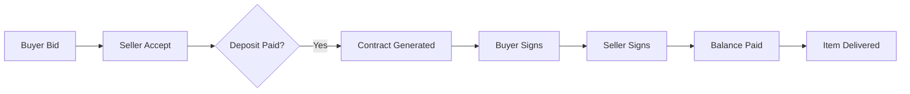
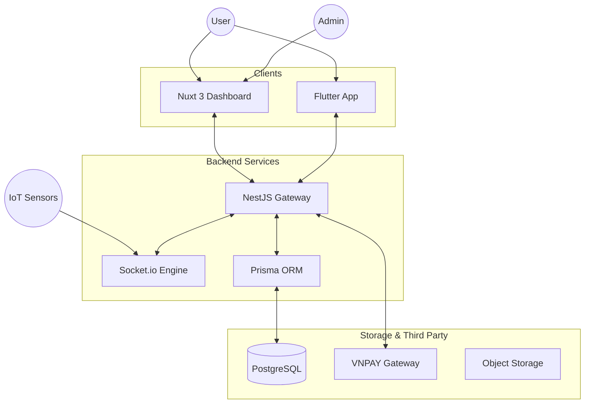

<div align="center">
  
  <h1>🔋 EV Resale Platform</h1>
  <p><b>The Future of Second-hand EV Battery Trading</b></p>

  [](https://nestjs.com/)
  [](https://nuxt.com/)
  [](https://flutter.dev/)
  [](https://prisma.io/)
  <br/>
  [](https://www.postgresql.org/)
  [](https://socket.io/)
  [](https://vnpay.vn/)
</div>

---

## 🌟 Overview

A comprehensive, multi-platform ecosystem designed to revolutionize the **Second-hand Electric Vehicle (EV) Battery** market. We bridge the gap between sustainability and technology through real-time IoT monitoring and secure transaction flows.

> [!IMPORTANT]
> This platform ensures trust via mandatory **eKYC**, **Smart Contract Signing**, and **Escrow Payments** via VNPAY.

---

## 🚀 Key Features

### 🛒 Marketplace & Auctions
- **Smart Trading**: Dynamic marketplace for Batteries, Vehicles, and Accessories.
- **Bidding Engine**: Real-time WebSocket-powered auction system.

### 🔌 IoT Monitoring
- **Live Diagnostics**: Continuous monitoring of Battery Health (SOC, SOH, Internal Temp).
- **PLC Integration**: Simulated data feeds via industrial protocol simulators.

### 🔒 Secure Workflow


---

## 🛠 System Architecture



---

## 📂 Project Structure

| Component | Technology | Description |
| :--- | :--- | :--- |
| **`be/`** | NestJS + Prisma | Core API logic, Auth, and Database management. |
| **`FE/`** | Nuxt 3 + Vue 3 | High-performance Web Dashboard for sellers and admins. |
| **`mobile/`** | Flutter | Premium mobile experience for buyers and on-the-go tracking. |
| **`scripts/`** | Bash / PS | Automation tools for deployment and initialization. |

---

## ⚙️ Quick Start

<details>
<summary><b>1. Prerequisites</b></summary>
- Node.js (v18+)
- Yarn / NPM
- Flutter SDK (for mobile)
- Docker Desktop
</details>

<details>
<summary><b>2. Backend Setup</b></summary>

```bash
cd be
yarn install
# Copy .env.example to .env and fill credentials
npx prisma migrate dev
yarn dev
```
</details>

<details>
<summary><b>3. Frontend Setup</b></summary>

```bash
cd FE
yarn install
yarn dev # Runs on http://localhost:3001
```
</details>

<details>
<summary><b>4. Mobile App Setup</b></summary>

```bash
cd mobile
flutter pub get
flutter run
```
</details>

---

## 🐳 Docker Support
Spin up the entire stack with one command:
```bash
docker-compose up -d
```

---

## 📝 License & Contributing
Licensed under internal use. We welcome contributions to improve EV sustainability!

---
<div align="center">
  Developed with ❤️ for the <b>EV Community</b>
</div>

