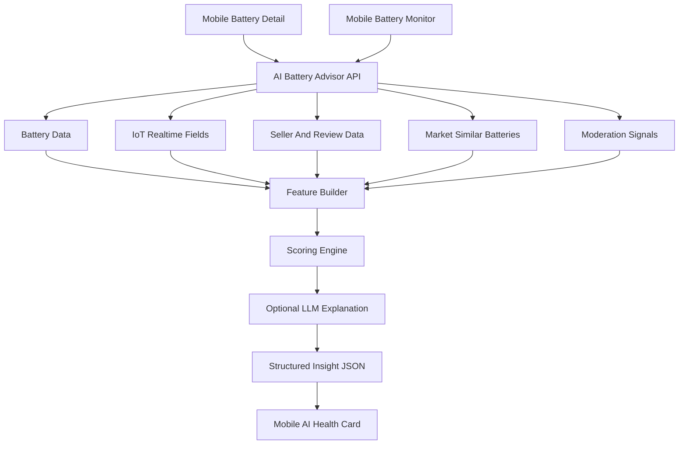

# AI Battery Health Advisor cho EV Resale Platform

## 1. Mục tiêu

Tài liệu này tập trung duy nhất vào ý tưởng **AI Battery Health Advisor**: tính năng AI đánh giá sức khỏe pin xe điện cũ, phân tích rủi ro và hỗ trợ người mua/người bán ra quyết định ngay trong ứng dụng.

Không triển khai code trong tài liệu này. Nội dung chỉ mô tả ý tưởng, dữ liệu, kiến trúc, luồng xử lý, MVP, roadmap và tính khả thi.

## 2. Vì sao chọn AI Battery Health Advisor

AI Battery Health Advisor phù hợp nhất với EV Resale Platform vì:

1. Pin xe điện là tài sản có rủi ro kỹ thuật cao khi mua bán lại.
2. Hệ thống đã có dữ liệu pin đủ tốt: type, capacity, voltage, condition, price, SOC, SOH, current, temperature.
3. Mobile đã có Battery Detail và Battery Monitor.
4. Backend đã có gợi ý giá pin từ pin tương tự.
5. Backend đã có moderation/spam scoring theo giá và nội dung.
6. IoT simulator đang cập nhật telemetry pin realtime.
7. Tính năng có thể demo trực quan hơn các AI feature chung chung.

Điểm mạnh lớn nhất: tính năng này dùng dữ liệu thật của domain EV, không phải chatbot tổng quát.

## 3. Bối cảnh hệ thống liên quan

### 3.1. Backend hiện có

Backend dùng NestJS, Prisma và PostgreSQL. Các module liên quan trực tiếp:

- `batteries`: quản lý pin, thông tin kỹ thuật, giá, trạng thái.
- `iot`: giả lập PLC, cập nhật telemetry pin realtime.
- `moderation`: chấm điểm spam/rủi ro listing dựa trên nội dung và giá bất thường.
- `transactions`: dữ liệu giao dịch, có thể dùng làm tín hiệu giá thực tế.
- `reviews`: đánh giá người bán/sản phẩm.
- `favorites`: tín hiệu quan tâm của người mua.

### 3.2. Mobile hiện có

Mobile dùng Flutter, Riverpod, GoRouter, Dio. Các màn hình liên quan:

- Battery List: xem danh sách pin.
- Battery Detail: xem chi tiết pin.
- Battery Monitor: theo dõi voltage, current, temperature, SOC, SOH realtime.
- Notifications/Profile/Chat: có thể mở rộng cho cảnh báo và tư vấn giao dịch.

### 3.3. Dữ liệu pin hiện có

| Nhóm            | Trường dữ liệu                               | Vai trò trong AI                     |
| --------------- | -------------------------------------------- | ------------------------------------ |
| Thông tin pin   | type, capacity, voltage, condition           | Đánh giá nền kỹ thuật                |
| Giá             | price                                        | So sánh với thị trường               |
| IoT realtime    | current, temperature, soc, soh               | Đánh giá sức khỏe và rủi ro vận hành |
| Trạng thái      | status, isActive, approvalStatus, isVerified | Độ tin cậy listing                   |
| Spam/moderation | spamScore, spamReasons                       | Cảnh báo listing đáng ngờ            |
| Người bán       | rating, totalRatings, KYC/profile            | Độ tin cậy người bán                 |
| Thị trường      | pin tương tự, giao dịch, favorites           | Tính giá hợp lý và confidence        |

## 4. Định nghĩa tính năng

AI Battery Health Advisor là một lớp phân tích đặt trên dữ liệu pin hiện có. Tính năng không chỉ hiển thị thông số kỹ thuật, mà chuyển chúng thành insight dễ hiểu cho người dùng.

### 4.1. Output chính

- Health Score: điểm sức khỏe pin từ 0-100.
- Risk Level: LOW, MEDIUM, HIGH, CRITICAL.
- Price Fairness: rẻ, hợp lý, đắt, đáng nghi.
- Estimated Fair Price: giá hợp lý ước tính.
- Warnings: cảnh báo kỹ thuật hoặc giao dịch.
- Strengths: điểm mạnh của pin.
- Recommendation: khuyến nghị hành động.
- Explanation: giải thích tiếng Việt ngắn gọn.
- Confidence: độ tin cậy của phân tích.

### 4.2. Người dùng mục tiêu

#### Người mua

Cần biết pin có đáng mua không, rủi ro gì, giá có hợp lý không.

#### Người bán

Cần biết pin nên được định giá thế nào, thông số nào nên nhấn mạnh, điểm nào cần minh bạch.

#### Admin

Cần phát hiện listing pin rủi ro: giá bất thường, thông tin thiếu, pin có telemetry xấu.

## 5. User flow đề xuất

### 5.1. Flow trên Battery Detail

1. Người dùng mở chi tiết pin.
2. App hiển thị thông tin pin như hiện tại.
3. App gọi backend để lấy AI insight.
4. UI hiển thị card “AI đánh giá pin”.
5. Người dùng bấm xem chi tiết để đọc cảnh báo, điểm mạnh, khuyến nghị.

### 5.2. Flow trên Battery Monitor

1. Người dùng mở màn hình monitor.
2. App nhận telemetry realtime từ Socket.io hoặc API hiện có.
3. AI insight được refresh theo trạng thái mới.
4. Nếu nhiệt độ/SOH/SOC bất thường, UI hiển thị cảnh báo.
5. Người dùng thấy biểu đồ + diễn giải AI thay vì chỉ thấy số liệu thô.

### 5.3. Flow cho người bán

1. Người bán tạo hoặc chỉnh listing pin.
2. Hệ thống phân tích condition, capacity, SOH, price.
3. AI gợi ý giá hợp lý và cảnh báo nếu mô tả thiếu dữ liệu quan trọng.
4. Người bán cải thiện listing trước khi đăng.

## 6. Kiến trúc đề xuất



## 7. Backend design đề xuất

### 7.1. Module

Tạo module backend riêng ở phase implementation:

- `ai-insights` hoặc `battery-advisor`.

Module này nên chỉ đọc dữ liệu, không thay đổi transaction/listing trong MVP.

### 7.2. Endpoint MVP

- `GET /api/ai/batteries/:id/health-advice`

Endpoint trả về insight cho một pin.

### 7.3. Endpoint mở rộng

- `POST /api/ai/batteries/compare`
- `POST /api/ai/batteries/price-analysis`
- `GET /api/ai/batteries/:id/realtime-risk`

### 7.4. Service responsibilities

1. Load battery theo id.
2. Load seller rating/reviews.
3. Load pin tương tự để tính market baseline.
4. Load moderation score.
5. Chuẩn hóa feature.
6. Tính healthScore, riskLevel, priceFairness, confidence.
7. Build explanation.
8. Return JSON cho mobile.

## 8. Input đề xuất

```json
{
  "batteryId": "string",
  "battery": {
    "type": "LITHIUM_ION",
    "capacity": 60,
    "voltage": 72,
    "condition": 85,
    "price": 45000000,
    "temperature": 34,
    "soc": 78,
    "soh": 88,
    "current": 12
  },
  "seller": {
    "rating": 4.7,
    "totalRatings": 12,
    "isKycVerified": true
  },
  "market": {
    "averagePrice": 48000000,
    "similarCount": 8
  },
  "moderation": {
    "spamScore": 0.12,
    "isVerified": true,
    "approvalStatus": "APPROVED"
  }
}
```

## 9. Output đề xuất

```json
{
  "healthScore": 84,
  "riskLevel": "MEDIUM",
  "priceFairness": "GOOD_DEAL",
  "estimatedFairPrice": 48000000,
  "confidence": 0.72,
  "warnings": [
    "Nhiệt độ pin đang cao hơn mức lý tưởng",
    "Nên kiểm tra SOH lại nếu dùng cho quãng đường dài"
  ],
  "strengths": [
    "SOH còn tốt so với pin cùng loại",
    "Giá thấp hơn mức trung bình thị trường"
  ],
  "recommendation": "Có thể cân nhắc mua nếu người bán cung cấp thêm kiểm tra kỹ thuật gần nhất.",
  "explanation": "Pin có SOH 88% và SOC 78%, phù hợp cho nhu cầu sử dụng thông thường. Giá hiện tại thấp hơn nhóm pin tương tự, tuy nhiên nhiệt độ đang hơi cao nên cần kiểm tra thêm trước khi giao dịch."
}
```

## 10. Scoring MVP

### 10.1. Health Score

Health Score có thể tính bằng weighted rule:

| Thành phần          | Trọng số | Gợi ý                            |
| ------------------- | -------: | -------------------------------- |
| SOH                 |      35% | SOH càng cao càng tốt            |
| Condition           |      20% | Lấy từ condition listing         |
| Temperature         |      15% | Phạt nếu quá nóng/quá thấp       |
| SOC                 |      10% | Phạt nếu SOC quá thấp khi test   |
| Voltage sanity      |      10% | Phạt nếu voltage lệch bất thường |
| Seller/verification |      10% | Rating, KYC, verified, approval  |

### 10.2. Risk Score

Risk Score cộng điểm phạt:

| Điều kiện                              | Điểm phạt |
| -------------------------------------- | --------: |
| SOH < 70                               |       +30 |
| Temperature > 45                       |       +25 |
| SOC < 20                               |       +15 |
| Price thấp hơn market quá nhiều        |       +15 |
| spamScore > 0.6                        |       +30 |
| Seller rating thấp hoặc chưa có rating |       +10 |
| Listing chưa verified/approval yếu     |       +10 |

Map risk:

| Risk score | Risk level |
| ---------: | ---------- |
|       0-24 | LOW        |
|      25-49 | MEDIUM     |
|      50-74 | HIGH       |
|     75-100 | CRITICAL   |

### 10.3. Price Fairness

So sánh price với market average từ pin tương tự:

| Tỷ lệ so với market | Label          |
| ------------------: | -------------- |
|               < 70% | SUSPICIOUS_LOW |
|              70-90% | GOOD_DEAL      |
|             90-110% | FAIR           |
|            110-130% | EXPENSIVE      |
|              > 130% | OVERPRICED     |

### 10.4. Confidence

Confidence phụ thuộc vào dữ liệu đủ hay thiếu:

| Tín hiệu                | Tác động        |
| ----------------------- | --------------- |
| Có SOH/SOC/temperature  | tăng confidence |
| Có nhiều pin tương tự   | tăng confidence |
| Seller có rating/review | tăng confidence |
| Listing verified        | tăng confidence |
| Thiếu telemetry         | giảm confidence |
| Similar count thấp      | giảm confidence |

## 11. Vai trò của LLM/Gemini

LLM không nên tự quyết định healthScore hoặc riskLevel. Backend nên tính score bằng rule/statistics trước, sau đó LLM chỉ diễn giải.

Luồng an toàn:

1. Backend lấy dữ liệu pin.
2. Backend tính score deterministic.
3. Backend tạo facts có cấu trúc.
4. LLM nhận facts và viết explanation tiếng Việt.
5. Backend validate output.
6. Nếu LLM lỗi, dùng template fallback.

Ví dụ facts gửi cho LLM:

```json
{
  "healthScore": 84,
  "riskLevel": "MEDIUM",
  "soh": 88,
  "soc": 78,
  "temperature": 34,
  "priceFairness": "GOOD_DEAL",
  "warnings": ["temperature_slightly_high"]
}
```

## 12. UI/UX đề xuất trên mobile

### 12.1. Battery Detail

Card “AI đánh giá pin” gồm:

- Health Score dạng vòng tròn hoặc progress bar.
- Risk badge màu xanh/vàng/cam/đỏ.
- Price fairness label.
- 2-3 bullet insight ngắn.
- Nút “Xem phân tích chi tiết”.

### 12.2. Battery Monitor

Thêm panel “AI realtime insight”:

- Trạng thái hiện tại: ổn định/cần chú ý/nguy hiểm.
- Cảnh báo nhiệt độ/SOH/SOC.
- Giải thích ngắn theo telemetry mới nhất.
- Không thay thế chart hiện tại, chỉ bổ sung diễn giải.

### 12.3. Seller flow

Khi người bán đăng pin:

- Hiển thị gợi ý giá hợp lý.
- Cảnh báo nếu thông tin kỹ thuật thiếu.
- Gợi ý bổ sung ảnh/giấy kiểm định/SOH.

## 13. MVP đề xuất

### 13.1. Phạm vi MVP

1. Backend endpoint phân tích một pin.
2. Rule-based scoring cho health/risk/price.
3. Mobile hiển thị AI card ở Battery Detail.
4. Battery Monitor hiển thị warning dựa trên telemetry hiện tại.
5. Explanation bằng template hoặc LLM optional.

### 13.2. Không làm trong MVP

- Không train ML model.
- Không thêm telemetry history table.
- Không notification tự động.
- Không compare nhiều pin.
- Không auto decision mua/bán.
- Không để LLM tự tính score.

### 13.3. Tiêu chí thành công MVP

- Người dùng hiểu nhanh pin có đáng mua không.
- Insight thay đổi khi telemetry thay đổi.
- UI rõ ràng, ít chữ, tiếng Việt.
- Có fallback khi thiếu dữ liệu.
- Không ảnh hưởng flow mua bán pin hiện tại.

## 14. Roadmap mở rộng

### Phase 1 - Rule-based advisor

- Tạo endpoint health advice.
- Tính healthScore, riskLevel, priceFairness.
- Hiển thị card trên Battery Detail.
- Thêm insight đơn giản trên Battery Monitor.

### Phase 2 - Better market baseline

- Dùng transaction completed để cải thiện fair price.
- Tách baseline theo type/capacity/condition/location.
- Thêm confidence rõ hơn.

### Phase 3 - Telemetry history

- Lưu lịch sử voltage/current/temperature/SOC/SOH.
- Phân tích trend thay vì chỉ snapshot.
- Cảnh báo SOH giảm nhanh hoặc nhiệt độ bất thường kéo dài.

### Phase 4 - Smart alerts

- Gửi notification khi pin yêu thích có rủi ro mới.
- Alert khi pin giá tốt nhưng health score cao.
- Alert khi telemetry vượt ngưỡng an toàn.

### Phase 5 - ML/LLM nâng cao

- ML định giá khi dữ liệu giao dịch đủ lớn.
- Predict battery degradation.
- LLM giải thích sâu hơn theo mục tiêu sử dụng của người mua.
- RAG theo tài liệu kỹ thuật pin nếu có knowledge base.

## 15. Rủi ro và giảm thiểu

| Rủi ro                                           | Tác động                         | Giảm thiểu                                            |
| ------------------------------------------------ | -------------------------------- | ----------------------------------------------------- |
| Dữ liệu ít                                       | Score chưa chính xác             | Hiển thị confidence và fallback                       |
| Telemetry hiện là simulator                      | Demo chưa phản ánh thiết bị thật | Ghi rõ môi trường demo dùng dữ liệu mô phỏng          |
| Người dùng hiểu khuyến nghị như cam kết kỹ thuật | Rủi ro trust/pháp lý             | Thêm disclaimer: chỉ tham khảo, cần kiểm định thực tế |
| LLM hallucination                                | Giải thích sai                   | LLM chỉ diễn giải facts, backend validate             |
| Rule quá cứng                                    | Kết quả thiếu linh hoạt          | Đưa threshold vào config, audit case thực tế          |
| Thiếu telemetry history                          | Không phân tích trend            | Đưa history vào roadmap phase sau                     |

## 16. Kết luận

AI Battery Health Advisor là tính năng AI nên ưu tiên cho EV Resale Platform. Tính năng này tận dụng trực tiếp dữ liệu pin và IoT hiện có, giải quyết đúng nỗi đau của người mua pin cũ: khó biết pin có khỏe, giá có hợp lý và giao dịch có rủi ro hay không.

MVP nên đi theo hướng đơn giản, chắc chắn:

1. Backend tính score bằng rule/statistics.
2. Mobile hiển thị insight rõ ràng trên Battery Detail và Battery Monitor.
3. LLM/Gemini chỉ dùng để diễn giải, không quyết định score.
4. Mở rộng dần sang telemetry history, alert và ML khi dữ liệu đủ lớn.
