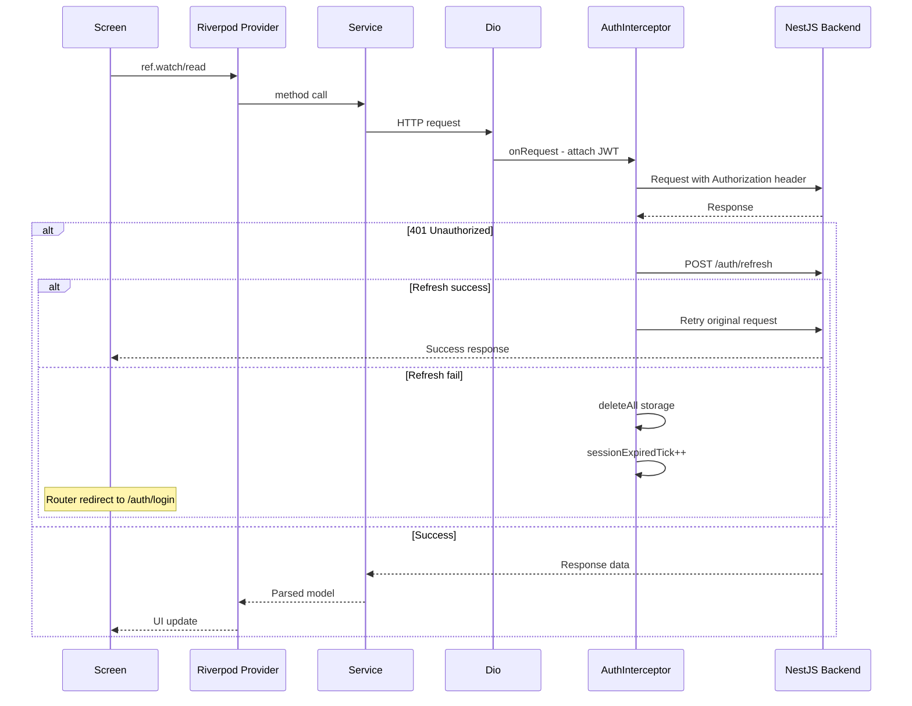

# MOBILE_CONTEXT.md

> Tài liệu kiến trúc chi tiết cho Flutter mobile app.
> Cập nhật: 2026-05-12

---

## 1. Tổng quan

**Package:** `evn_battery_trading`
**SDK:** Flutter 3.10+ / Dart >=3.10.0
**State management:** Riverpod (flutter_riverpod + riverpod_annotation)
**Navigation:** GoRouter 14
**HTTP:** Dio 5 + AuthInterceptor auto-refresh
**Real-time:** socket_io_client (Chat `/chat` + IoT `/iot`)
**Auth:** JWT (FlutterSecureStorage) + Google Sign-In
**L10n:** vi + en (ARB files, flutter_localizations)

---

## 2. Kiến trúc tổng quan

```
mobile/lib/
├── main.dart                    # Entry point, ProviderScope, MaterialApp.router
├── core/                        # Shared infrastructure
│   ├── auth/                    # sessionExpiredTickProvider (StateProvider<int>)
│   ├── constants/               # AppConstants (baseUrl, keys, labels)
│   ├── locale/                  # localeProvider (StateProvider<Locale?>)
│   ├── network/                 # Dio client + AuthInterceptor + parseApiError
│   ├── router/                  # GoRouter config + auth redirect
│   ├── theme/                   # AppTheme (light + dark, Material3)
│   └── utils/                   # AppUtils (format, validate, resolveImageUrl)
├── features/                    # Feature-based modules
│   ├── auth/                    # Login, Register, ForgotPassword, Splash, Welcome
│   │   ├── providers/           # AuthNotifier (AsyncNotifier<AuthState>)
│   │   └── screens/
│   ├── home/screens/            # HomeScreen (1864 dòng - landing page)
│   ├── batteries/screens/       # List, Detail, Sell, Monitor (IoT)
│   ├── vehicles/screens/        # List, Detail, Sell
│   ├── accessories/screens/     # List, Detail, Sell
│   ├── auctions/                # List, Detail, Create
│   │   ├── providers/           # auctionListProvider, auctionDetailProvider, auctionBidsProvider
│   │   └── screens/
│   ├── chat/                    # ChatList, ChatRoom (Socket.io), SignaturePad
│   │   ├── screens/
│   │   └── widgets/             # ContractMessageCard (469 dòng)
│   ├── notifications/screens/   # NotificationsScreen
│   ├── profile/screens/         # ProfileScreen, KycVerificationScreen
│   └── admin/screens/           # KycManagementScreen, KycReviewDetailScreen
├── models/                      # Data models (manual fromJson/toJson)
├── services/                    # API service layer (Dio-based)
└── widgets/                     # Shared reusable widgets
```

**Pattern:** Feature-based → mỗi feature có `screens/`, một số có `providers/` và `widgets/`.

---

## 3. Models

| Model                   | File                              | Mô tả                                                             |
| ----------------------- | --------------------------------- | ----------------------------------------------------------------- |
| `UserModel`             | `models/user_model.dart`          | User + displayName, isAdmin, isModerator                          |
| `AuthResponse`          | `models/user_model.dart`          | access_token + refresh_token + user + requiresProfileCompletion   |
| `VehicleModel`          | `models/vehicle_model.dart`       | Xe điện, images[], seller, statusLabel                            |
| `VehicleListResponse`   | `models/vehicle_model.dart`       | Paginated response (data, total, page, limit)                     |
| `BatteryModel`          | `models/battery_model.dart`       | Pin, type/capacity/condition, typeLabel, statusLabel              |
| `BatteryListResponse`   | `models/battery_model.dart`       | Paginated + hasMore getter                                        |
| `AccessoryModel`        | `models/accessory_model.dart`     | Phụ kiện, category, compatibleModel                               |
| `AccessoryListResponse` | `models/accessory_model.dart`     | Paginated response                                                |
| `AuctionModel`          | `models/auction_model.dart`       | Đấu giá, startingPrice/currentPrice/bidStep, media[], statusLabel |
| `AuctionMedia`          | `models/auction_model.dart`       | Media item (url, sortOrder)                                       |
| `BidModel`              | `models/auction_model.dart`       | Bid (amount, bidder, auctionId)                                   |
| `ChatRoomModel`         | `models/chat_model.dart`          | Room buyer↔seller, lastMessage, getOtherUser()                    |
| `ChatMessageModel`      | `models/chat_model.dart`          | Message, metadata, isRead, isMine()                               |
| `NotificationModel`     | `models/notification_model.dart`  | Notification (title, message, type, isRead)                       |
| `StatsOverview`         | `models/stats_model.dart`         | totalUsers, totalTransactions, batteriesListed, vehiclesListed    |
| `DashboardOverviewData` | `services/dashboard_service.dart` | totalOrders, favoriteCount, activeListings                        |
| `DashboardOrderData`    | `services/dashboard_service.dart` | Order item (inline model)                                         |
| `DashboardFavoriteData` | `services/dashboard_service.dart` | Favorite item (inline model)                                      |

**Lưu ý:** Tất cả models đều viết tay `fromJson`/`toJson`, không dùng code generation (`json_serializable` có trong dev_dependencies nhưng chưa dùng).

---

## 4. Services (API Layer)

Mỗi service là class nhận `Dio` qua constructor, exposed qua Riverpod `Provider`.

| Service               | Provider                      | Endpoints chính                                                                                                                             |
| --------------------- | ----------------------------- | ------------------------------------------------------------------------------------------------------------------------------------------- |
| `AuthService`         | `authServiceProvider`         | login, register, getProfile, forgotPassword, verifyOtp, resendOtp, resetPassword, googleLogin, refreshToken                                 |
| `VehicleService`      | `vehicleServiceProvider`      | getVehicles, getVehicleById, getMyVehicles, createVehicle, updateVehicle, deleteVehicle, uploadListingImages                                |
| `BatteryService`      | `batteryServiceProvider`      | getBatteries, getBatteryById, getMyBatteries, createBattery, updateBattery, deleteBattery, getStatistics, suggestPrice, uploadListingImages |
| `AccessoryService`    | `accessoryServiceProvider`    | getAccessories, getAccessoryById, getMyAccessories, createAccessory, updateAccessory, deleteAccessory, uploadListingImages                  |
| `NotificationService` | `notificationServiceProvider` | getMyNotifications, getUnreadCount, markAsRead, markAllAsRead                                                                               |
| `DashboardService`    | `dashboardServiceProvider`    | getOverview, getOrders, getFavorites                                                                                                        |
| `StatsService`        | `statsServiceProvider`        | getOverview                                                                                                                                 |

**Upload pattern:** `uploadListingImages()` trùng lặp trong 3 services (vehicle, battery, accessory) — cùng logic gọi `POST /uploads/listing-images`.

---

## 5. Navigation & Routing

### 5.1 Router Config

**File:** `core/router/app_router.dart`
**Provider:** `appRouterProvider` (Provider<GoRouter>)

### 5.2 Auth Guard (redirect)

```
Splash → check token → Home (/) hoặc Welcome (/welcome)
sessionExpiredTick > 0 && !publicRoute → /auth/login
!isLoggedIn && !publicRoute → /welcome
isLoggedIn && publicRoute (trừ /splash) → /
```

### 5.3 Route Map

| Path                    | Screen                | Shell       |
| ----------------------- | --------------------- | ----------- |
| `/splash`               | SplashScreen          | No          |
| `/welcome`              | WelcomeScreen         | No          |
| `/auth/login`           | LoginScreen           | No          |
| `/auth/register`        | RegisterScreen        | No          |
| `/auth/forgot-password` | ForgotPasswordScreen  | No          |
| `/`                     | HomeScreen            | MainShell ✓ |
| `/batteries`            | BatteryListScreen     | MainShell ✓ |
| `/batteries/:id`        | BatteryDetailScreen   | MainShell ✓ |
| `/vehicles`             | VehicleListScreen     | MainShell ✓ |
| `/vehicles/:id`         | VehicleDetailScreen   | MainShell ✓ |
| `/accessories`          | AccessoryListScreen   | MainShell ✓ |
| `/accessories/:id`      | AccessoryDetailScreen | MainShell ✓ |
| `/sell/battery`         | SellBatteryScreen     | MainShell ✓ |
| `/sell/vehicle`         | SellVehicleScreen     | MainShell ✓ |
| `/sell/accessory`       | SellAccessoryScreen   | MainShell ✓ |
| `/auctions`             | AuctionListScreen     | MainShell ✓ |
| `/auctions/:id`         | AuctionDetailScreen   | MainShell ✓ |
| `/auctions/create`      | CreateAuctionScreen   | MainShell ✓ |
| `/chat`                 | ChatListScreen        | MainShell ✓ |
| `/chat/:roomId`         | ChatRoomScreen        | MainShell ✓ |
| `/profile`              | ProfileScreen         | MainShell ✓ |
| `/notifications`        | NotificationsScreen   | MainShell ✓ |
| `/battery-monitor/:id`  | BatteryMonitorScreen  | MainShell ✓ |

### 5.4 Bottom Navigation (MainShell)

5 tabs: Trang chủ (`/`) → Danh mục (`/batteries`) → Đấu giá (`/auctions`) → Đăng bán (bottom sheet menu) → Tài khoản (`/profile`)

**Đăng bán** mở BottomSheet với 3 tùy chọn: Pin / Xe / Phụ kiện.

### 5.5 Navigation Flow Diagram

```mermaid
graph TD
    Splash[/splash] --> CheckAuth{Token?}
    CheckAuth -->|Yes| Home[/ - HomeScreen]
    CheckAuth -->|No| Welcome[/welcome]
    Welcome --> Login[/auth/login]
    Welcome --> Register[/auth/register]
    Login --> Home
    Login --> ForgotPW[/auth/forgot-password]
    Register --> Home

    subgraph MainShell - Bottom Nav
        Home
        Categories[/batteries /vehicles /accessories]
        Auctions[/auctions]
        Sell[Đăng bán BottomSheet]
        Profile[/profile]
    end

    Home --> Categories
    Categories --> Detail[/:type/:id - Detail Screen]
    Detail --> Chat[/chat/:roomId]
    Detail --> BatteryMonitor[/battery-monitor/:id]
    Auctions --> AuctionDetail[/auctions/:id]
    Sell --> SellBattery[/sell/battery]
    Sell --> SellVehicle[/sell/vehicle]
    Sell --> SellAccessory[/sell/accessory]
    Profile --> KYC[KycVerificationScreen]
    Home --> Notifications[/notifications]

    SessionExpired[401 + refresh fail] -->|sessionExpiredTick++| Login
```

---

## 6. API Integration Flow

### 6.1 Dio Client

**File:** `core/network/dio_client.dart`

```
dioProvider (Provider<Dio>)
├── BaseOptions: baseUrl = AppConstants.baseUrl, timeout 15s
├── AuthInterceptor: attach JWT, auto-refresh on 401
└── LogInterceptor: request/response/error logging
```

### 6.2 Request Flow



### 6.3 Base URL Resolution

```
.env API_BASE_URL → override
Android emulator  → http://10.0.2.2:3000/api
iOS / Web         → http://localhost:3000/api
```

### 6.4 Image URL Resolution

`AppUtils.resolveImageUrl()`: nếu path relative → prepend `baseUrl.replaceAll('/api', '')`.

### 6.5 Error Handling

`parseApiError()` trong `dio_client.dart`: xử lý DioException types (connection, timeout) + extract message từ response body.

---

## 7. State Management

### 7.1 Pattern

**Riverpod** — không dùng Bloc/Cubit.

| Loại Provider           | Sử dụng                                                          |
| ----------------------- | ---------------------------------------------------------------- |
| `Provider`              | Services (AuthService, VehicleService, etc.), Dio client         |
| `StateProvider`         | Simple state (locale, sessionExpiredTick, auctionRealtimeTick)   |
| `AsyncNotifierProvider` | Auth state (AuthNotifier)                                        |
| `FutureProvider`        | Data fetching (batteries, vehicles, stats, auctions, chat rooms) |
| `FutureProvider.family` | Detail fetching by ID (auctionDetail, auctionBids, chatRoom)     |

### 7.2 Providers Map

| Provider                      | Type                                             | File                                                 |
| ----------------------------- | ------------------------------------------------ | ---------------------------------------------------- |
| `dioProvider`                 | `Provider<Dio>`                                  | `core/network/dio_client.dart`                       |
| `sessionExpiredTickProvider`  | `StateProvider<int>`                             | `core/auth/session_state_provider.dart`              |
| `localeProvider`              | `StateProvider<Locale?>`                         | `core/locale/locale_provider.dart`                   |
| `appRouterProvider`           | `Provider<GoRouter>`                             | `core/router/app_router.dart`                        |
| `authStateProvider`           | `AsyncNotifierProvider<AuthNotifier, AuthState>` | `features/auth/providers/auth_provider.dart`         |
| `currentUserProvider`         | `Provider<UserModel?>`                           | `features/auth/providers/auth_provider.dart`         |
| `authServiceProvider`         | `Provider<AuthService>`                          | `services/auth_service.dart`                         |
| `vehicleServiceProvider`      | `Provider<VehicleService>`                       | `services/vehicle_service.dart`                      |
| `batteryServiceProvider`      | `Provider<BatteryService>`                       | `services/battery_service.dart`                      |
| `accessoryServiceProvider`    | `Provider<AccessoryService>`                     | `services/accessory_service.dart`                    |
| `notificationServiceProvider` | `Provider<NotificationService>`                  | `services/notification_service.dart`                 |
| `dashboardServiceProvider`    | `Provider<DashboardService>`                     | `services/dashboard_service.dart`                    |
| `statsServiceProvider`        | `Provider<StatsService>`                         | `services/stats_service.dart`                        |
| `auctionListProvider`         | `FutureProvider<List<AuctionModel>>`             | `features/auctions/providers/auction_providers.dart` |
| `auctionDetailProvider`       | `FutureProvider.family<AuctionModel, String>`    | `features/auctions/providers/auction_providers.dart` |
| `auctionBidsProvider`         | `FutureProvider.family<List<BidModel>, String>`  | `features/auctions/providers/auction_providers.dart` |
| `auctionRealtimeTickProvider` | `StateProvider.family<int, String>`              | `features/auctions/providers/auction_providers.dart` |
| `homeBatteriesProvider`       | `FutureProvider<BatteryListResponse>`            | `features/home/screens/home_screen.dart`             |
| `homeVehiclesProvider`        | `FutureProvider<VehicleListResponse>`            | `features/home/screens/home_screen.dart`             |
| `homeStatsProvider`           | `FutureProvider<StatsOverview>`                  | `features/home/screens/home_screen.dart`             |
| `chatRoomProvider`            | `FutureProvider.family<Map, String>`             | `features/chat/screens/chat_room_screen.dart`        |

### 7.3 Ghi chú

- Nhiều providers được khai báo **inline** trong screen files (homeBatteriesProvider, homeVehiclesProvider, chatRoomProvider) thay vì tách riêng vào `providers/`.
- Auctions là feature duy nhất có folder `providers/` riêng ngoài auth.
- Không dùng `riverpod_generator`/`@riverpod` annotation dù có trong dev_dependencies.

---

## 8. Auth & Session Handling

### 8.1 Login Flow

1. User nhập email/password → `AuthNotifier.login()`
2. `AuthService.login()` → `POST /auth/login`
3. Response: `AuthResponse` (access_token, refresh_token, user)
4. Save vào `FlutterSecureStorage`: `access_token`, `refresh_token`, `user_data` (JSON)
5. Reset `sessionExpiredTickProvider` = 0
6. Update `authStateProvider` → `AuthState(user: response.user)`
7. GoRouter redirect → `/`

### 8.2 Google Login Flow

1. `GoogleSignIn.signIn()` → get account
2. `account.authentication` → get `idToken`
3. `AuthService.googleLogin(idToken)` → `POST /api/auth/google/verify`
4. Same save flow as local login

### 8.3 Token Refresh (Auto)

1. `AuthInterceptor.onError()` detect 401
2. Skip nếu là refresh request hoặc đã retry
3. Call `_refreshAccessToken()` → `POST /auth/refresh` with refresh_token
4. Dùng static `_refreshingTokenFuture` để tránh concurrent refresh
5. Success → save new tokens → retry original request với Dio mới
6. Fail → `deleteAll()` storage → `sessionExpiredTick++`
7. GoRouter redirect detect tick > 0 → redirect to `/auth/login`

### 8.4 Session Restore (App Start)

1. `SplashScreen` → wait 1.2s animation
2. `ref.read(authStateProvider.future)` → `AuthNotifier.build()` → `_loadFromStorage()`
3. Check: access_token + refresh_token + user_data in storage
4. Nếu thiếu refresh_token → `deleteAll()` → unauthenticated
5. Nếu đủ → parse UserModel → authenticated
6. Navigate: authenticated → `/` hoặc unauthenticated → `/welcome`

### 8.5 Logout

`AuthNotifier.logout()` → `deleteAll()` + reset sessionExpiredTick → state = empty AuthState

### 8.6 Password Reset

3-step flow: `forgotPassword(email)` → `verifyOtp(resetId, otp)` → `resetPassword(resetId, resetToken, password)`

---

## 9. Shared Widgets

| Widget                | File                                               | Mô tả                                                                |
| --------------------- | -------------------------------------------------- | -------------------------------------------------------------------- |
| `MainShell`           | `widgets/main_shell.dart`                          | Bottom nav shell (5 tabs), Đăng bán BottomSheet                      |
| `AppNetworkImage`     | `widgets/app_network_image.dart`                   | CachedNetworkImage + shimmer loading + placeholder + resolveImageUrl |
| `AppTextField`        | `widgets/app_text_field.dart`                      | Themed TextFormField, forceLightStyle cho auth forms                 |
| `LoadingButton`       | `widgets/loading_button.dart`                      | ElevatedButton with isLoading spinner                                |
| `ContractMessageCard` | `features/chat/widgets/contract_message_card.dart` | Contract proposal card trong chat (469 dòng)                         |

---

## 10. Utilities

### AppConstants (`core/constants/app_constants.dart`)

- `baseUrl` — dynamic resolve từ .env / platform
- `googleWebClientId` — .env / compile-time / hardcoded default
- Storage keys: `access_token`, `refresh_token`, `user_data`
- `pageSize` = 10, `cacheTimeout` = 1h
- Label maps: batteryTypeLabels, batteryStatusLabels, auctionStatusLabels, transactionStatusLabels, sortOptions

### AppUtils (`core/utils/app_utils.dart`)

- `formatCurrency()` — VNĐ format
- `formatDate()`, `formatDateTime()` — dd/MM/yyyy
- `timeAgo()` — relative time (phút/giờ/ngày trước)
- `formatCountdown()` — auction countdown
- `batteryConditionLabel()` — condition → text
- `truncate()`, `isValidEmail()`, `isValidPhone()`
- `resolveImageUrl()` — relative → absolute URL

### AppTheme (`core/theme/app_theme.dart`)

- Material3, seedColor = primaryGreen (#16A34A)
- Light + Dark theme
- Font: BeVietnamPro (configured but commented out in pubspec)
- Consistent border radius: 14px (buttons, inputs), 24px (cards), 20px (chips)

---

## 11. WebSocket Integration

### 11.1 Chat (`/chat` namespace)

**File:** `features/chat/screens/chat_room_screen.dart`

- Connect: `socket_io_client` → `baseUrl.replaceAll('/api', '') + /chat`
- Auth: `{ token: accessToken }` in handshake
- Events: `joinRoom`, `sendMessage`, `newMessage`, `markAsRead`
- History: REST `GET /chat/rooms/:roomId/messages` → then WS for real-time
- Contract messages: metadata `{ type: 'CONTRACT' }` → render `ContractMessageCard`

### 11.2 IoT Battery Monitor (`/iot` namespace)

**File:** `features/batteries/screens/battery_monitor_screen.dart`

- Connect: `baseUrl.replaceAll('/api', '') + /iot`
- Auth: same JWT token pattern
- Events: `subscribeBattery(batteryId)` → listen `battery:telemetry`
- Data: voltage, current, temp, SOC, SOH → real-time charts (fl_chart)
- Buffer: keep last 20 data points for chart

---

## 12. Localization (L10n)

- **Files:** `lib/l10n/app_vi.arb`, `lib/l10n/app_en.arb`
- **Generated:** `lib/l10n/app_localizations.dart`, `app_localizations_vi.dart`, `app_localizations_en.dart`
- **Config:** `l10n.yaml` at project root
- **Usage:** `AppLocalizations.of(context)!.keyName`
- **Locale switching:** `localeProvider` (StateProvider<Locale?>) — null = system default
- **Default:** Vietnamese

---

## 13. Vùng rủi ro & Cần cải thiện

### 🔴 Nghiêm trọng

1. **HomeScreen 1864 dòng** — `features/home/screens/home_screen.dart` quá lớn, cần tách thành nhiều widget files
2. **ContractMessageCard 469 dòng** — `features/chat/widgets/contract_message_card.dart` nên tách logic + UI
3. **ChatRoomScreen 555 dòng** — inline ChatMessage model + socket logic + UI trong 1 file
4. **Google Client ID hardcoded** — `AppConstants` có fallback `_defaultGoogleWebClientId` hardcoded

### 🟡 Kiến trúc

5. **uploadListingImages() trùng lặp** — cùng logic copy-paste trong VehicleService, BatteryService, AccessoryService → nên extract thành shared UploadService
6. **Providers inline trong screen files** — `homeBatteriesProvider`, `homeVehiclesProvider`, `homeStatsProvider`, `chatRoomProvider` định nghĩa trong screen thay vì tách ra providers/
7. **ChatMessage model trùng lặp** — `ChatRoomScreen` define riêng `ChatMessage` class, khác với `ChatMessageModel` trong `models/chat_model.dart`
8. **DashboardService chứa inline models** — `DashboardOverviewData`, `DashboardOrderData`, `DashboardFavoriteData` nên tách ra `models/`
9. **Không dùng code generation** — `json_serializable`, `riverpod_generator`, `retrofit_generator` có trong dev_dependencies nhưng không được sử dụng
10. **Auction route conflict** — `/auctions/:id` và `/auctions/create` có thể xung đột (GoRouter match `:id` = "create")

### 🟠 Chất lượng

11. **Không có error/empty state handling thống nhất** — mỗi screen tự xử lý khác nhau
12. **Không có pull-to-refresh cho list screens** — chỉ HomeScreen có RefreshIndicator
13. **MainShell bottom nav** — Danh mục tab luôn navigate tới `/batteries`, không có cách chuyển giữa batteries/vehicles/accessories từ bottom nav
14. **withOpacity() deprecated** — một số file dùng `withOpacity()` thay vì `withValues(alpha:)`
15. **FlutterSecureStorage static instances** — AuthInterceptor, AuthNotifier, ChatRoomScreen, BatteryMonitorScreen đều tạo `const FlutterSecureStorage()` riêng thay vì share qua provider
16. **KYC/Admin screens** — `admin/screens/` có nhưng không có route trong `app_router.dart` → dead code hoặc chưa tích hợp

### 🟢 Tốt

- Feature-based structure rõ ràng
- Auto token refresh pattern robust (concurrent refresh protection)
- Session expiration → auto redirect to login
- Consistent theme system (light + dark)
- Vietnamese localization throughout
- Shared widgets pattern (AppNetworkImage, AppTextField, LoadingButton)
- Image URL resolution centralized

---

## 14. Dependencies chính

| Package                      | Version   | Mục đích                     |
| ---------------------------- | --------- | ---------------------------- |
| `flutter_riverpod`           | ^2.5.1    | State management             |
| `go_router`                  | ^14.0.0   | Navigation                   |
| `dio`                        | ^5.4.3    | HTTP client                  |
| `flutter_secure_storage`     | ^9.0.0    | JWT token storage            |
| `socket_io_client`           | ^2.0.3+1  | WebSocket (chat + IoT)       |
| `google_sign_in`             | ^6.2.1    | Google OAuth                 |
| `cached_network_image`       | ^3.3.1    | Image caching                |
| `shimmer`                    | ^3.0.0    | Loading placeholders         |
| `fl_chart`                   | ^0.68.0   | Battery monitor charts       |
| `intl`                       | ^0.20.2   | Date/number formatting       |
| `image_picker`               | ^1.1.2    | Image selection for listings |
| `flutter_form_builder`       | ^10.3.0+2 | Form building                |
| `infinite_scroll_pagination` | ^4.0.0    | Paginated lists              |
| `pinput`                     | ^5.0.0    | OTP input                    |
| `percent_indicator`          | ^4.2.3    | Battery SOC/SOH display      |
| `flutter_dotenv`             | ^5.1.0    | Environment config           |

---

## 15. Ghi chú cho AI Assistant

- Mobile dùng Riverpod (không Bloc), GoRouter, Dio
- Backend API prefix luôn là `/api`
- Token lưu trong `FlutterSecureStorage`
- Khi thêm feature mới: tạo folder trong `features/<name>/screens/`, thêm route trong `app_router.dart`
- Khi thêm API: tạo service trong `services/`, model trong `models/`, provider trong feature `providers/`
- Khi thêm shared widget: đặt trong `widgets/`
- HomeScreen cần refactor — quá lớn, cần tách trước khi thêm tính năng mới
- Upload image logic nên extract thành shared service trước khi tạo thêm listing types
- Luôn test cả light mode và dark mode
